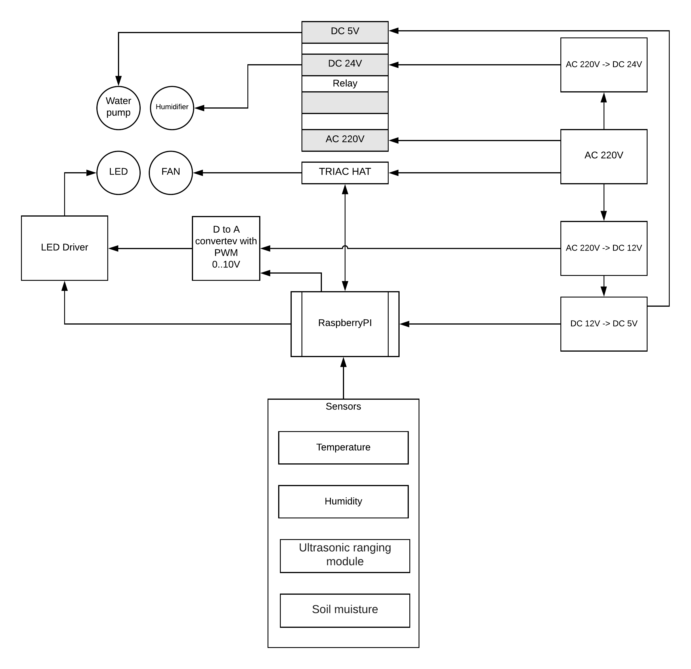

# WigwamBox

 

WigwamBox is a smart growbox that completely automates the growing process.

It is a completely open source solution that you can assemble at home without deep technical knowledge.

WigramBox uses the most modern technologies and approaches for both the hardware and its software.

The cost of materials for assembly varies from $ 350 to $ 400, depending on the configuration that you choose (box volume, number of carbon filters, number of sensors and brands of components)

## Accessories

Here is a list of what you will need to purchase before starting. The table shows the ideal options, but you can replace some parts if you need it.

* Secret Jardin Hydroshoot 40x40x120
* MW ELG-100-48B
* Carbon filter 100mm x 2
* Canal FAN 100mm
* Air canal connector 100mm
* Quantum Board (Samsung LM301B)
* Green Room Ratchet Hangers (for LED) x 2
* Raspberry PI 4 Model B
* Temperature Humidity Sensor DHT-22
* [2-CH TRIAC HAT](https://www.waveshare.com/2-ch-triac-hat.htm)
* Electric plug 220V
* Power cord 2*0.5, 10m
* signal cord 3x0.5, 10m
* Terminal block CY8HW-12P-1.2
* OLED display HC-SR04
* Toggle switch 220v
* Power supply RITAR RTPS24-24
* Water pump 5v
* Soil moisture sensor for RaspberryPI
* Relay 4ch 220v
* Humidifier 24v

## Assembly

When all the parts arrive, you can start assembling.
The complete set is selected to minimize the process.
All you need to do is just find a suitable box (or laser cut a red [Indian case](./img/box.svg)) and place all the parts in it.

### General scheme

### Pinout

#### Relay

| Dev   | PI  |
|-------|:---:|
| GND   | 9   |
| IN1   | 31  |
| IN2   | 33  |
| IN3   | 35  |
| IN4   | 37  |
| VCC   | 2   |

#### Display

| Dev   | PI  |
|-------|:---:|
| GND   | 20  |
| VCC   | 17  |
| SCL   | 5   |
| SDA   | 3   |

#### Soil Moisture Sensor

| Dev   | PI  |
|-------|:---:|
| AO    | -   |
| DO    | 40  |
| GND   | 14  |
| VCC   | 4   |

#### DHT-22

| Dev   | PI  |
|-------|:---:|
| +     | 1   |
| OUT   | 7   |
| -     | 6  |

## Software

And of course, the heart of Wigwamos is software.
You can find detailed instructions on how to prepare the software and the application itself in the WigwamOS repository

Happy growing!
